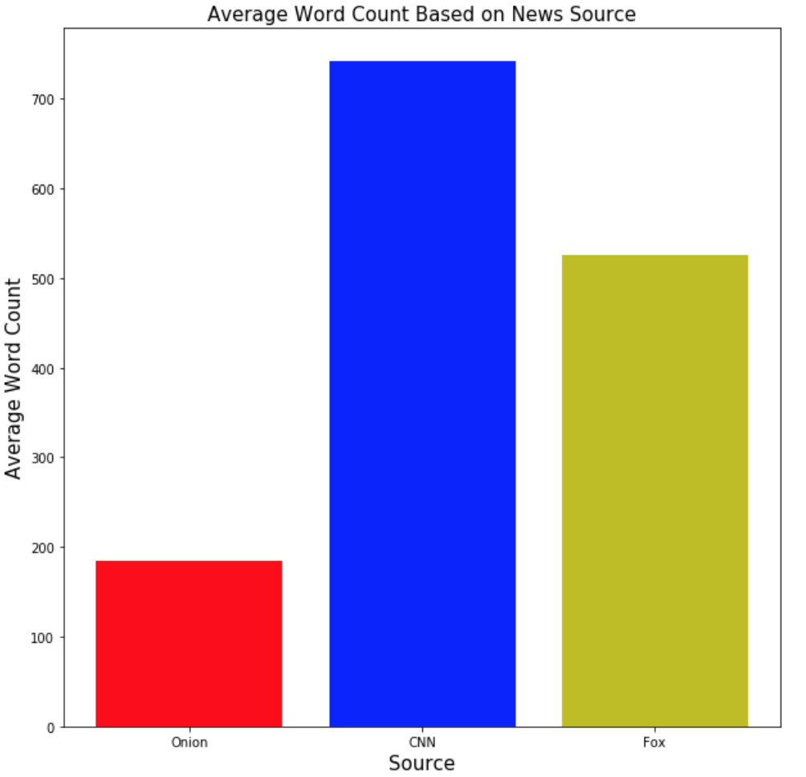
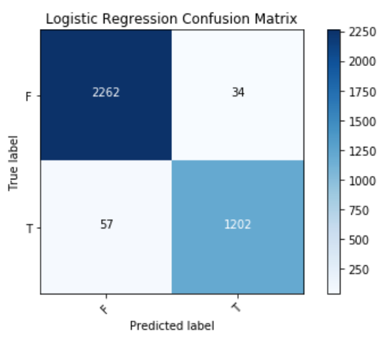
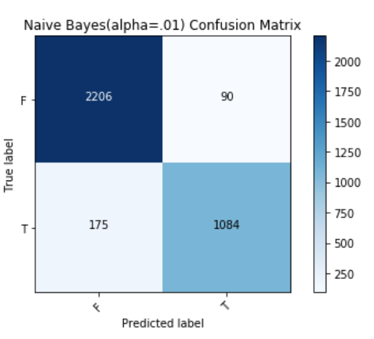
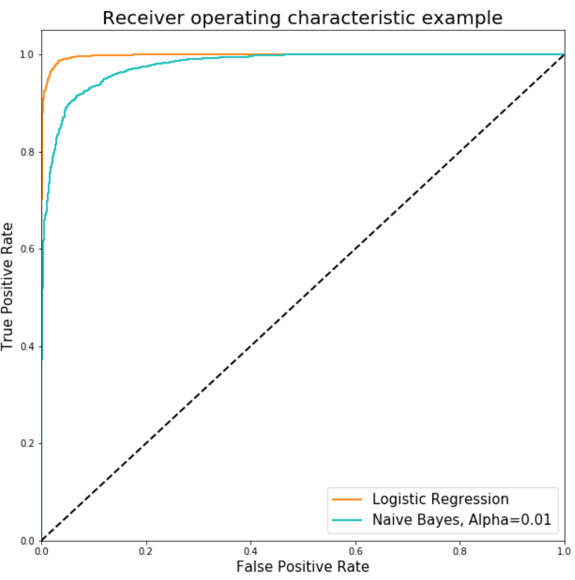
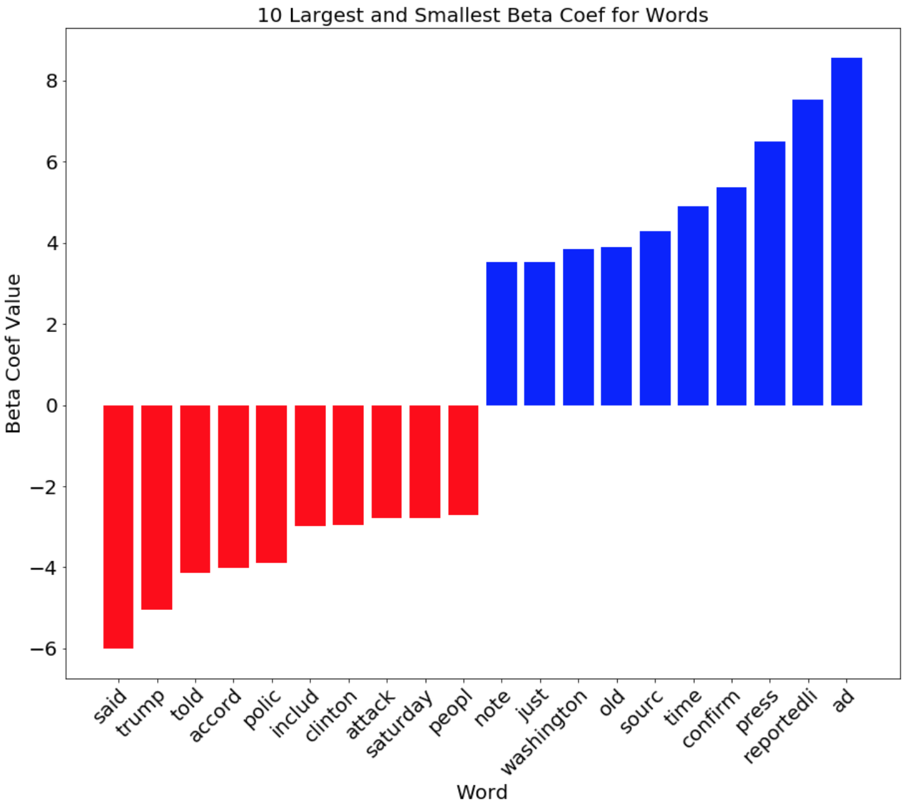
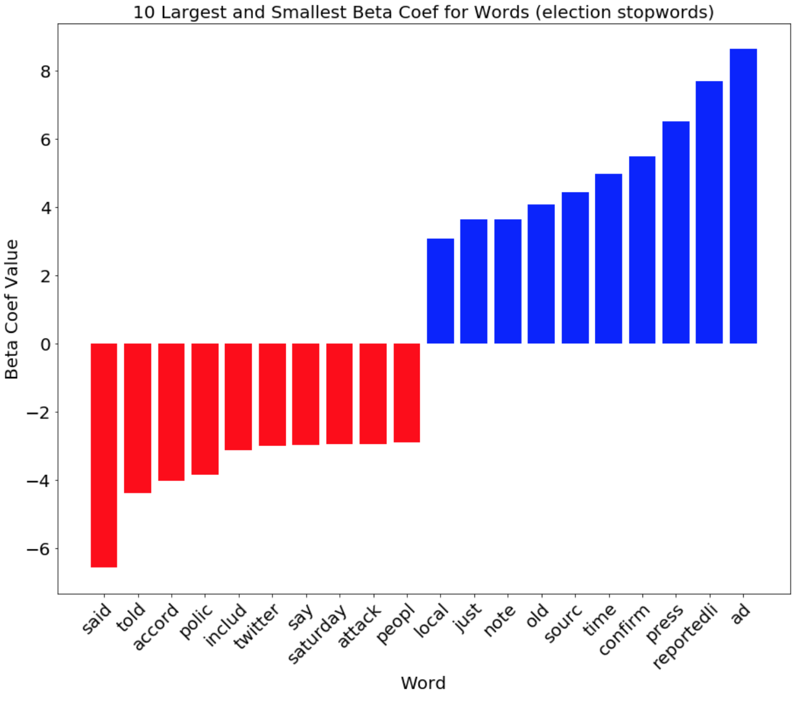
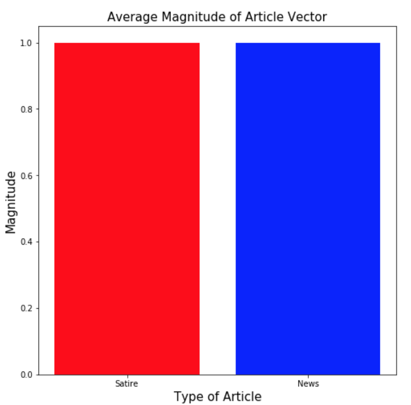
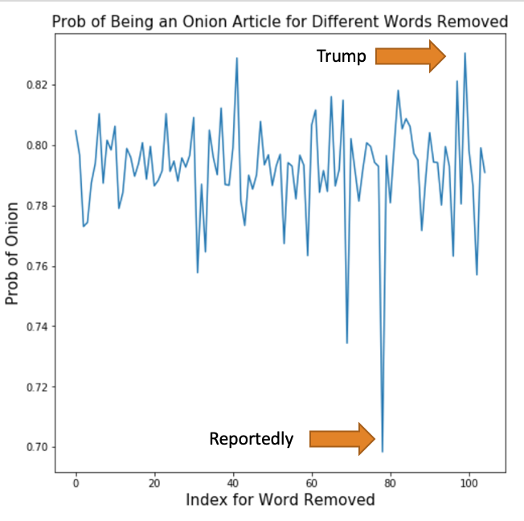

# The Onion or Real News
## Introduction
This project is an investigation into if an article can be distinguished between “The Onion” and real news based on the text. Fake news is a hot topic in the national conscience these days, and it is important for people to be able to distinguish the two. This project addressed a small portion of this problem by addressing “The Onion.” “The Onion” is a satirical media company that publishes articles in a voice that are trying to mimic the tone and structure of traditional news reporting in a satirical way. Throughout “The Onions” existence, many prominent people and countries have fallen for their articles and believed them to be true. In 2012, “The Onion” ran an article that stated Kim Jong Un was the sexiest man alive for that year, and China picked up the story and ran with it as fact. There are even sub-reddits dedicated to examples of times people fell for different articles. In order to help people not fall for articles from “The Onion,” I built a model that can distinguish between articles from "The Onion", and actual news sources. 

    
    
To accomplish this task, I will use natural language processing and different modeling techniques to predict where the article was published. I will be using articles from "The Onion", "CNN", and "Fox News". The first step will be to build a model that can differentiate between satire and actual news. Then I will see if my model can differentiate between "CNN", and "Fox News".

## Repository Information
A more in depth look into this project can be found in the Onion_or_News_notebook.ipynb found here:
https://github.com/johncpolitte/News_or_Satire/blob/master/Onion_or_News_notebook.ipynb

All of the code for this project can be found in the src file here: https://github.com/johncpolitte/News_or_Satire/tree/master/src  

The helper_functions.py file contains all of the functions used in the jupyter notebook mentioned above. 

web_scraper.py is the file used to scrape "The Onion" articles from their website and store them in a MongoDB. This was done using an EC2 on AWS. 

onion_to_csv.py converts the MongoDB into a csv file in the EC2 so it could be transferred to a local machine for further investigation. 

## Previous Work
Similar studies have been done to this one. One of them are described below: 

I found a similar study done by Dawn Graham. Her results can be found here: https://towardsdatascience.com/fake-news-or-not-edad1552aa02. She used natural language processing to build a logistic regression model that would predict whether or not an article came from r/TheOnion or r/nottheonion based on the headlines of the articles. 

My approach is different from the previous approach's because I am using the content of news articles from the respective article sources. I believe my approach will be more successful because the articles have more context then just a headline.

## Data Source
The CNN and Fox news articles are coming from a dataset that I found online. The data is stored as a CSV and can be found here: https://www.kaggle.com/lenamkhanh/analyzing-the-news/code. There are around 5,000 Fox News articles and around 15,000 CNN articles. 
    
For the Onion articles, I built a webscraper that scraped the content of each article and stored them into MongoDB. Ideally I will have upwards of 5,000 articles, so that I can have the same size set of articles for each "news" source. 

## Exploritory Data Analysis
I found that the average word count for each of the three sources of articles differed dramatically. Because of this, it was necessary to use a normalization process in the vectorization of the articles. The average word counts can be found in the bar chart below.

In the Logistic Regression Exploration section I ran two separate tests to confirm the normalization process was working. 

## Article Vectorization
Before the models could be trained, the data was split into a training and testing set. 25% of the articles were used to test the models, while the remaining 75% of the data was used to train the models. After the data was split, the training data was fit and transformed into a tfidf vectorizor, in order to get a term-document matrix for training purposes. For this transformation, various natural language processing techniques were used via the main_tokenize function that can be found in the helper_functions.py file. This function tokenized all of the words in each document, removed stop words, and stemmed all of the words. A maximum document frequency of .9, and a minimum document frequency of 10 were used after performing a grid search to optimize these parameters. The vectors were also normalized, so that the sum of squares of the vector elements was 1. Finally, the testing data was transformed into the term-document matrix, so it could be used for testing in the models. This was performed after the training data to prevent data leakage. 

## Model Results
In order to classify an article as being from "The Onion" or a news source I trained two different models. 

The first model trained was a logistic regression model. This model was selected because it is a great tool for binary classification problems, and its interpretability is straight forward. By using this model, the various variables (in this case, the words in the corpus) were easy to investigate because their association with news and Onion articles were able to be measured by their beta coefficients. 

The second model that was trained was a Naïve Bayes classifier because it is generally a good baseline for text classification models. The model assumes independence for all of the words in the corpus, which is necessary when there are a large number of features (words in corpus) with varying degrees of importance. A grid search was also performed to optimize the alpha value for the model. The grid search returned an alpha value of .01. 

Both of these models ended up performing very well, but the logistic regression model outperformed the Naïve Bayes classifier by a small margin. The Logistic Regression model had an accuracy of 97%, and an F1 score of 96%, while the Naïve Bayes classifier had an accuracy of 93% and an F1 Score of 89%. The confusion matrices, and ROC curves for both of these models are shown below. 

## Logistic Regression Exploration
The logistic regression model was performing suspiciously well, so an exploration into the features was performed to gain a better understanding of how the model was classifying the articles into the two classes. The graph below shows the stemmed words that are most associated with an article being classified as news in red, and the words most associated with “The Onion” in blue. 

One concern with the results of this exploration was the number of “election terms” that were associated with news articles. This was concerning because a large number of news articles came from the time of the election, so Fox and CNN were covering it extensively. To address this issue “election terms” like trump, clinton, election, primary, republican and democrat were added to the stop word removal process. The complete list of stop words are listed in the helper_functions.py file. The model ended up performing just as well as it previously did and the new words and their associations with being classified as a news article, or Onion article are shown below. 

### Half of a CNN article
To confirm that the data was being normalized correctly I performed two separate tests. The first test was to cut a CNN article to be the length of an average Onion article. Using an article that was 196 words, the logistic regression model still classified the article to be a news article with a probability of 80%. 

### Magnitude of Tfidf Vectors
The second test was to find the average magnitude of all the Onion article vectors, and news article vectors after the articles were vectorized using the TFIDF Vectorizor. The average magnitude for the Onion article vectors and news article vectors can be found in the bar graph below. Both had an average magnitude of 1. With both of these tests I was able to confirm that the normalization process was working correctly. 

### Trump Onion Article
To gain a deeper understanding of how the logistic regression model was working an Onion article about Trump was tested because the word Trump has such a strong association with an article being classified as a News article. The probability of the article being classified as an Onion article was plotted as every word in the corpus was removed one at a time. This graph is shown below. The probability of the article being classified as an Onion article never drops below 70% regarless of which word was removed. The lowest probability corresponds to when 'reportedli' was removed from the test corpus, and the highest probability corresponds with the word 'trump' being removed from the corpus. This confirms that the model was working correctly because "reportedli" has such a strong association with an article being classified as an Onion article, and 'trump' has such a strong association with the article being classified as a news article. This small test gives a better understanding to how the logistic regression model works, and confirms it is working correctly. 

## Future Exploration
This project had very promising results, but there are a few different directions it can go for future studies. For the next iteration of the project, I would gather more sources of satire to train the model. This would allow me to actually test if the model can pick up on satire instead of just differentiating between “Onion” articles and news articles. 
After this iteration of the project, I would also train the model using local news sources that target smaller audiences. “The Onion” writing style tends to target a local audience, while CNN and Fox News target a national audience. By training the model with local news sources I would be able to eliminate some some of the bias in the model, but the performance would likely decrease. 

